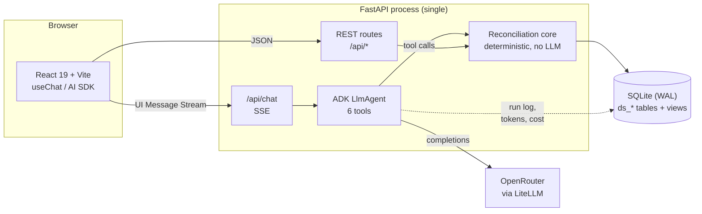
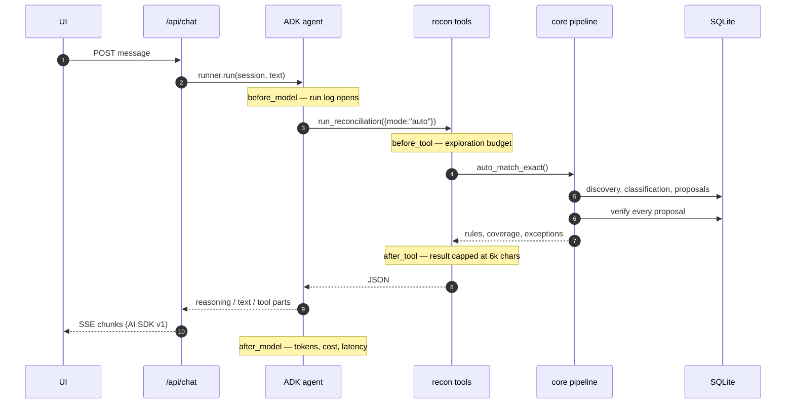
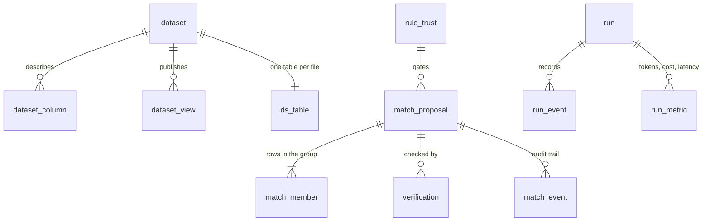

# Architecture

Ledgerline reconciles arbitrary CSV exports against each other. There is no
canonical schema, no configured field mapping and no declared relationship
between the files: which columns join, which direction the money flows and
which column holds the amount are all measured from the data on upload.

The organising constraint is that **the language model never does arithmetic**.
Every figure the UI shows is produced by SQL over source rows and traces back to
a `(dataset, row)` pointer. The agent chooses what to look at and explains what
came back; it never supplies a number.

---

## System

**The agent runs inside the FastAPI process**, not behind a separate
`adk api_server`. One event bus, one SQLite handle, and no cross-process
plumbing between the agent and the stream the browser is reading. The cost is
that the API cannot be scaled horizontally without moving the store first.

---

## A turn, end to end

Chunks are translated from ADK events in
[`streaming/translator.py`](../backend/app/streaming/translator.py) and built by
[`streaming/protocol.py`](../backend/app/streaming/protocol.py), whose typed
mirror is `frontend/src/types/stream.ts`. **Change one, change the other.**

Agent prose, reasoning and tool calls use the SDK's native chunk types so
`useChat` renders them with no custom code. Agent status and the token/cost
meter travel as custom `data-*` parts, where two behaviours are load-bearing:

- a data part with a **stable `id`** updates in place instead of appending — one
  live status row rather than a growing list;
- a part marked **`transient`** reaches `onData` but never enters message
  history — correct for high-frequency meter ticks.

---

## Modules

| Path | Responsibility |
| --- | --- |
| `core/ingest.py` | Sniff, type and load a CSV into its own `ds_<id>` table |
| `core/duplicates.py` | Mark repeated rows at ingest; per-dataset exclusion policy |
| `core/discovery.py` | Value-overlap matrix across every column pair; `trace_record` |
| `core/embedded.py` | Keys buried inside free text (a narration carrying an order ref) |
| `core/automatch.py` | Cardinality classification, amount discovery, rule construction |
| `core/matching.py` | Turn matching SQL into proposals; confidence; the release gate |
| `core/verify.py` | Independent second pass; twelve invariants; the only door to `accepted` |
| `core/timing.py` | Settlement lag learned from the rule's own groups |
| `core/spine.py` | Which dataset transactions start from, inferred from matched pairs |
| `core/transactions.py` | Group proposals into end-to-end chains along the spine |
| `core/report.py` | The close report: value, flow, exceptions, accountability, limits |
| `core/sqlguard.py` | Read-only SQL execution for agent queries |
| `agents/root_agent.py` | The single `LlmAgent` and its instruction |
| `agents/tools/recon.py` | The six tools ([TOOLS.md](TOOLS.md)) |
| `agents/callbacks.py` | Exploration budget, result capping, run/token accounting |
| `eval/` | Scoring against labelled fixtures; the CI gate |

---

## Data model

Each uploaded file becomes its own table, `ds_<id>`, with a synthetic `__row`
primary key plus two mark columns (`__duplicate_of`, `__duplicate_kind`).
Derived columns are published as **views** rather than written back, so a rule
written later inherits them:

- `v_*_norm` — a split credit/debit pair republished as one signed column
- `v_*_key` — a reference extracted from inside a text column

A proposal is a group of members; a member is a `(dataset_id, row)` pointer with
a signed `amount_minor`. Money is integer minor units throughout. Nothing is
ever deleted: duplicates are marked, rejected proposals are kept, and
`match_event` records every status change.

---

## Frontend

Three columns, one job each — the reconciled rail on the left, the conversation
in the middle, source files on the right — plus a home page, an upload page and
a `/report` route. Routing is a fifty-line History wrapper (`app/router.tsx`)
rather than a dependency; three screens do not justify one.

Providers wrap the router, not the reverse: a question typed on the upload
screen is answered on the workspace, and a chat provider mounted per-route would
drop the stream mid-turn.

---

## Where the numbers come from

| Surface | Source |
| --- | --- |
| Coverage, edges | `matching.reconciliation_status()` |
| Transaction chains | `transactions.build(spine)` |
| Report totals | source cells, via the column recovered by `verify.trace_amount` |
| Token / cost meter | `run_metric`, summed per run — one row per model call |
| Confidence | recomputed by the verifier, never taken from the proposal |

See [RULE-ENGINE.md](RULE-ENGINE.md) for how a match is decided,
[TOOLS.md](TOOLS.md) for the agent surface, and
[LIMITATIONS.md](LIMITATIONS.md) for what this does not do.
