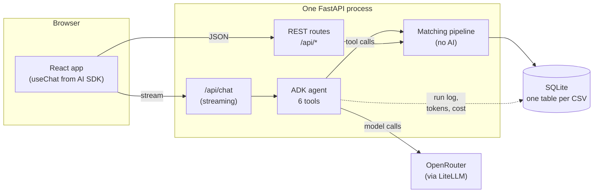
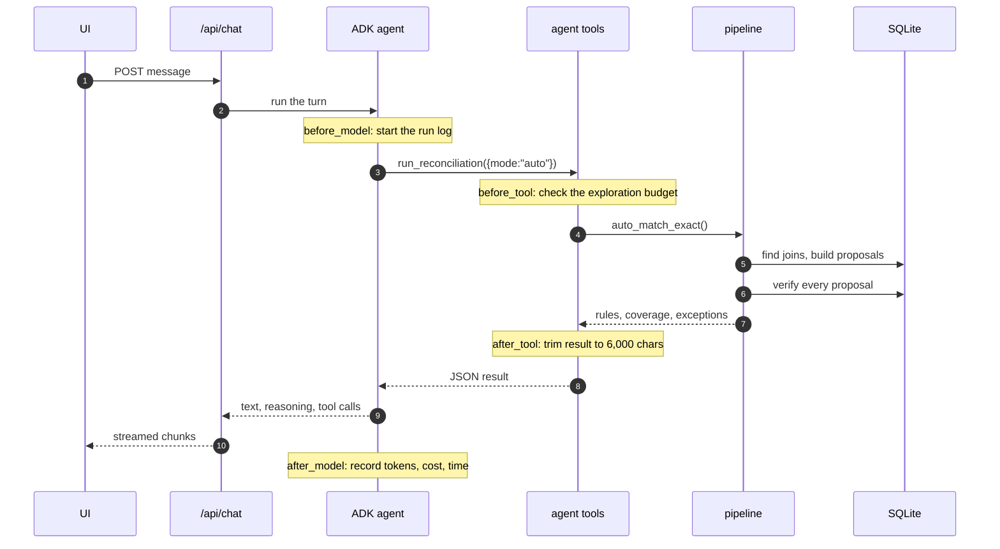
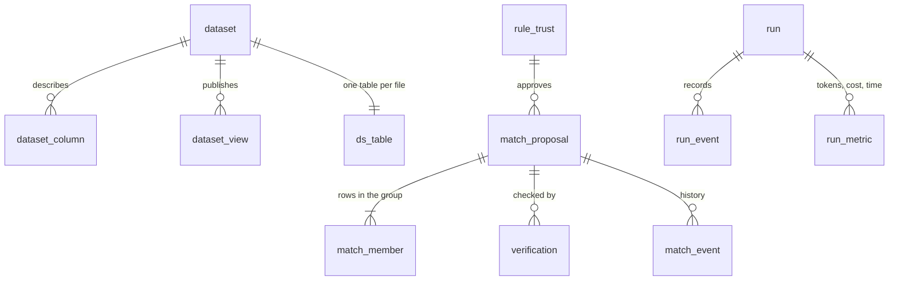

# Architecture

This page explains how Ledgerline is put together: the main parts, what happens
when you send a chat message, where the code lives, and how data is stored.

The main rule to keep in mind: **the AI agent never does arithmetic.** Every
number comes from SQL run over the uploaded rows. The agent decides what to run
and explains the results.

---

## The main parts

- **Frontend:** a React app with three screens (upload, workspace, report).
- **REST routes** (`backend/app/api/`) cover uploads, proposals, coverage, the
  report and similar. The UI calls these directly for anything that isn't chat.
- **The agent** runs **inside** the FastAPI process, not as a separate service.
  That keeps one process and one database connection, with no messaging between
  services. The catch is that you can't run several copies of the API until the
  database moves off SQLite.
- **The matching pipeline** (`backend/app/core/`) does all the real work. The
  REST routes and the agent's tools both call into it. See
  [RULE-ENGINE.md](RULE-ENGINE.md).

---

## What happens in one chat turn

### The stream format

The chat response uses the Vercel AI SDK's "UI Message Stream" format, sent as
server-sent events. Three files define it:

- [`streaming/translator.py`](../backend/app/streaming/translator.py) turns
  ADK events into stream chunks.
- [`streaming/protocol.py`](../backend/app/streaming/protocol.py) builds the
  chunks.
- `frontend/src/types/stream.ts` is the TypeScript copy of `protocol.py`.
  **If you change one, change the other.**

Text, reasoning and tool calls use the SDK's built-in chunk types, so `useChat`
shows them without custom code. The agent's status and the token/cost meter use
custom `data-*` parts. Two behaviours matter:

- A data part with a **fixed `id`** replaces the earlier part with that id, so
  the status shows as one updating line, not a growing list.
- A part marked **`transient`** reaches the `onData` callback but isn't saved
  in the message history. That suits the meter, which updates often.

---

## Where the code lives

| Path | What it does |
| --- | --- |
| `core/ingest.py` | Reads a CSV, guesses column types, loads it into its own table |
| `core/duplicates.py` | Marks repeated rows; per-file setting to exclude them |
| `core/discovery.py` | Finds columns whose values overlap across files |
| `core/embedded.py` | Finds references hidden inside text columns |
| `core/automatch.py` | Decides join shape and amount column, writes the matching SQL |
| `core/matching.py` | Turns SQL results into proposals, scores them, approves them |
| `core/verify.py` | The independent second check before anything is accepted |
| `core/timing.py` | Learns the normal settlement delay for each rule |
| `core/spine.py` | Decides which file the flow of money starts from |
| `core/transactions.py` | Groups matches into end-to-end chains |
| `core/report.py` | Builds the close report |
| `core/sqlguard.py` | Runs the agent's SQL on a read-only connection |
| `agents/root_agent.py` | The agent and its instructions |
| `agents/tools/recon.py` | The six tools ([TOOLS.md](TOOLS.md)) |
| `agents/callbacks.py` | Exploration budget, result trimming, token and cost tracking |
| `eval/` | Scores the pipeline against labelled test data |

---

## How data is stored

- **Each uploaded file becomes its own table**, named `ds_<id>`. Every table
  gets a `__row` primary key plus two columns for duplicate marks:
  `__duplicate_of` and `__duplicate_kind`.
- **Derived columns are added as views**, never written back into the table:
  - `v_<name>_norm` combines separate credit and debit columns into one signed
    amount.
  - `v_<name>_key` holds a reference pulled out of a text column.
- **A proposal** (`match_proposal`) is a suggested match. Its members
  (`match_member`) each point to one row as `(dataset_id, row)` and carry a
  signed amount.
- **Money is stored as whole numbers in minor units** (paise, cents), never as
  floats.
- **Nothing is deleted.** Duplicates are marked, rejected proposals are kept,
  and every status change is logged in `match_event`.
- **Rule approval** lives in `rule_trust`, stored against a hash of the rule's
  SQL.
- **Migrations** are plain SQL files in `db/migrations/`, applied in order at
  startup. To change the schema, add a new numbered file; never edit an old
  one.

---

## Frontend

- **Workspace layout:** three columns. Matched results on the left, chat in
  the middle, source files on the right.
- **Other pages:** a home page, an upload page and `/report`.
- **Routing:** a small wrapper around the browser History API
  (`app/router.tsx`), not a routing library.
- **Providers sit above the router.** The datasets, proposals and chat
  providers wrap the router, not the other way round. A question typed on the
  upload screen keeps streaming after you move to the workspace. If the chat
  provider were mounted per page, the stream would be cut off on navigation.

---

## Where each number comes from

| On screen | Computed by |
| --- | --- |
| Coverage and links between files | `matching.reconciliation_status()` |
| Transaction chains | `transactions.build(spine)` |
| Report totals | the original cells, located by `verify.trace_amount` |
| Token and cost meter | `run_metric`, one row per model call, summed per run |
| Confidence | recomputed by the verifier, never copied from the proposal |
