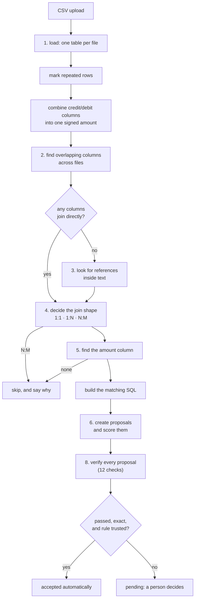

# The rule engine

This is the part of Ledgerline that finds and checks matches. It uses **no
AI**: the same files always give the same result. That is why the evaluation
harness scores this pipeline, not the agent.

One idea runs through every step: **measure from the data instead of
hard-coding a setting.** A value that suits one payment provider is wrong for
the next. So each threshold below is either worked out from the uploaded files,
or is a minimum chosen so that an unclear case is refused rather than guessed.

The code is mostly in `backend/app/core/`. `automatch.auto_match_exact()` runs
the whole pipeline.

---

## The steps



---

## 1. Duplicate rows

When a file is uploaded, each repeated row is marked in two columns,
`__duplicate_of` and `__duplicate_kind`. Nothing is deleted.

| Kind | How it's spotted | Meaning |
| --- | --- | --- |
| `exact` | every column is identical | the same event recorded twice |
| `near` | identical except for the columns that identify the row (like an id) | probably the same event, with a new id |

**Finding the id columns.** These are the columns with the most distinct values,
compared with the file's other columns. A column must still have at least 50%
distinct values (`IDENTITY_FLOOR = 0.5`). The comparison is relative because a
real id column drops below 100% distinct as soon as the file has duplicates.

**A guard against false duplicates.** Two rows count as `near` duplicates only
if they also share an amount column and a text reference
(`MIN_REFERENCE_RATIO = 0.5`). Without this, two separate payments that happen
to share a status and currency would be merged.

**Duplicates are kept in the sums by default.** Dropping a duplicate makes its
group balance, and a balanced group can be approved automatically. On the test
data, that turned real problems into silent auto-matches: accuracy fell from
100% to 81.7%. Excluding duplicates is therefore a per-file setting. Only
someone who knows the file can say whether a repeat is an error in the export.

## 2. Finding links between files

`discovery.py` compares the values of every column with every column in the
other files and measures how much they overlap. That is how it learns, for
example, that `internal.external_txn_ref` and `stripe.charge_id` hold the same
ids, without relying on column names.

A column that looks like a category (few distinct values) is judged **as a
pair**, not on its own. A `settlement_batch_id` might have only 7 values across
100 gateway rows, which looks like a status. But in the bank file those same 7
values appear once each, so it's a real link. A pair is treated as a category
only when values repeat on *both* sides.

## 3. References hidden inside text

Bank statements often don't have the order number in its own column. Instead
it sits inside a description, like `NEFT-RZP-ORD-1001`. Step 2 compares whole
cells, so it misses this.

`embedded.py` checks whether one column's values appear *inside* another
column's text often enough, and clearly enough, to be the link. It knows
nothing about bank formats or prefixes. When it finds a link, it publishes the
extracted value as a new column (the `v_<name>_key` view) that later steps
use like any other column.

Each guard below has a test that fails if the guard is removed:

| Guard | Value | Why |
| --- | --- | --- |
| `MIN_KEY_CHARS` | 4 | `"IN"` appears inside `"REMITTANCE"` |
| `MIN_NUMERIC_KEY_CHARS` | 6 | short numbers appear inside other text by chance far too often |
| `MIN_CONTAINMENT` | 0.5 | the key must explain at least half the rows |
| `ALREADY_JOINED` | 0.25 | skip if the files already join directly |
| `MAX_PRODUCT` | 40M row pairs | the search compares every row with every row; above this it's skipped |

If a text cell contains two different keys, it links to **nothing**, not to a
guess. A link found this way is weaker evidence than a shared column, so it
must also be confirmed by matching amounts before it can propose anything.

## 4. Join shape

A shared column alone doesn't tell you how rows relate. Each link is classified
first:

| Shape | How it's matched | Example |
| --- | --- | --- |
| 1:1 | row against row | an order and its payment |
| 1:N | `SUM(many side) = one side` | a bank settlement and the payments in it |
| 1:N | only one type of row counts ("partitioned") | only `CAPTURE` rows match an order; refunds don't |
| N:M | **skipped** | no group could be checked |

**Which side is the "one".** A side counts as the "one" when its key is nearly
unique (`UNIQUE_KEY = 0.98`). If neither side is, the "one" is whichever side is
clearly more distinct: at least 1.5× (`DOMINANCE`), with at least half its
values unique (`NEARLY_UNIQUE = 0.5`). A fixed cut-off doesn't work, because a
statement with duplicate deposits (the very problem being found) can drop to
77% unique.

## 5. Finding the amount column

The money column is never chosen by its name. Each pair of numeric columns is
tried across the join, and the pair whose values agree most often wins. A pair
needs at least 60% agreement (`AMOUNT_AGREEMENT = 0.60`). The bar is low on
purpose: in test data with many exceptions, the right pair agreed on 91% of
rows, while wrong pairs agreed on almost none.

Details that matter:

- **Numbers stored as text still count.** A column becomes text if even a few
  rows hold junk. If at least 80% of its values look like numbers
  (`NUMERIC_TEXT = 0.80`), it's still tried.
- **Coverage beats agreement.** Strategies are compared by how many rows they
  explain first, then by how often they agree. Otherwise a narrow match on four
  refund rows (100% agreement) would beat a batch match that explains ninety.
- **Empty and zero cells don't count as agreement.** A column that never
  varies is also rejected. Without this, a `merchant_id` that is the same on
  every row, or a discount that is almost always 0, would beat the real
  amount.

## 6. Confidence

Each proposal gets a label, computed from the numbers its SQL returned:

| Label | Meaning | Can be auto-approved |
| --- | --- | --- |
| `exact` | the amounts balance to zero | **yes** |
| `within_tolerance` | off by less than the rule's rounding allowance | no |
| `high` | ids match, but there's no amount to check | no |
| `ambiguous` | a row appears in more than one group, or the group sits inside a single file | no |
| `unbalanced` | the amounts don't balance | no |

The rounding allowance is learned from batch groups and capped at 1.00 per group
(`MAX_RESIDUAL`).

## 7. Timing

A batch can match to the paisa and still be late. "Late" depends on each
provider's agreement, so instead of a fixed number of days, `timing.py` learns
the usual delay from the rule's own groups and flags groups far outside it.

It looks for a clear gap between normal and slow groups. If there's no clear
gap, it falls back to a standard outlier test (1.5× the interquartile range).

- The gap must be at least 1.5× the normal spread below it (`GAP_DOMINANCE`).
- A rule needs at least 8 groups before any are flagged (`MIN_GROUPS`).
- At most half a rule's groups can be flagged (`MAX_FLAGGED_SHARE = 0.5`).
- Nothing under 12 hours is ever called late (`MIN_ABSOLUTE_GAP_SECONDS`).

## 8. Verification

Confidence is worked out from the numbers the SQL returned, so it can't tell
when those numbers are wrong. For example, `COALESCE(amount, 0)` turns a missing
amount into a 0 that balances perfectly.

So `verify.py` checks every proposal separately. It trusts only the row
pointers `(dataset, row)`, re-reads each original cell, and redoes the sums with
exact decimals:

| Check | Question it answers |
| --- | --- |
| `members_resolve` | do the rows exist? |
| `spans_two_datasets` | does the group span at least two files? |
| `member_record_consistent` | does the stored summary still match the rows? |
| `amounts_traceable` | is each amount actually in the row it claims to come from? (a zero never is) |
| `balance_recomputed` | does the group still balance in exact decimals? |
| `balance_matches_record` | does that agree with the stored balance? |
| `single_claim_per_edge` | is any row already used by another accepted match on the same link? |
| `currency_uniform` | is the whole group in one currency? |
| `timing_consistent` | is the delay far outside what's normal for this rule? |
| `duplicate_rows_excluded` | is any member a repeat of another row in its file? |
| `no_residual_evidence` | did the rule leave out a row carrying the same key (like a refund)? |
| `confidence_consistent` | does the label recomputed here match the stored one? |

## 9. Approval

`matching.release()` is the **only** code that sets a proposal to `accepted`,
and it refuses unless verification passes. There are three ways to reach it:

1. **Automatically**, right after a proposal is created, but only if it is
   `exact` **and** its rule is trusted.
2. **Approving a rule** (`trust_rule`). This releases the `exact` and
   `within_tolerance` proposals that rule is holding. Each one is still
   verified.
3. **A person clicking accept** on a single proposal.

**Which rules are trusted:**

- Rules from the automatic pass (names starting with `auto_`) are trusted
  immediately. They cover the whole dataset, so they can't be scoped wider than
  the question.
- A rule the agent writes starts as `unproven` and needs a person to approve it
  once.
- Trust is tied to the rule's **SQL**, not just its name. If different SQL is
  sent under an existing rule name, it's refused. The `auto_` prefix is
  reserved for the automatic pass.

**Rejections stick.** A group a person rejected isn't proposed again under the
same rule. Any new group that reuses a rejected row waits for a person instead
of being auto-approved.

**Overrides.** A person can force-accept a proposal that failed verification.
That is recorded as an override, and the close report counts overrides.

---

## Before changing any of this

Measure the change with the evaluation harness instead of judging it by eye:

```bash
cd backend
uv run python -m app.eval --fixture <dir>
uv run python -m app.eval --fixture <dir> --max-false-auto-match 0.03 --min-recall 0.95
```

Watch the **false auto-match rate** most closely: of the matches approved
without a person, how many were wrong.
