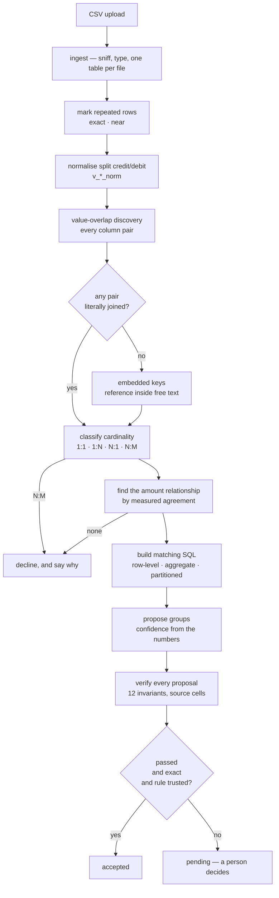

# The rule engine

No LLM runs in any of this. Given the same files it produces the same answer,
which is why it — and not the agent turn — is what the evaluation harness gates.

The single principle behind every stage: **nothing is configured that can be
measured.** A constant that is right for one processor's contract is wrong for
the next dataset, and a threshold tuned on the file in front of you fails
silently on the file after it. Every number below is either derived from the
data or is a floor chosen so that a degenerate case is refused rather than
guessed at.

---

## The pipeline



---

## 1 · Duplicate marking

Runs at ingest, writing `__duplicate_of` and `__duplicate_kind` onto the row.
Two plain `GROUP BY` passes; nothing is ever deleted.

| Class | Test | Meaning |
| --- | --- | --- |
| `exact` | every column equal, byte for byte | one event, recorded twice |
| `near` | equal on everything describing the event, differing only in columns that identify the row | two candidate records |

Identity columns are found **relatively** — whichever columns tie for the most
distinct values, subject to a floor (`IDENTITY_FLOOR = 0.5`). Every absolute
cut-off tried here failed on some file just below it: two duplicates in a
twelve-row export drag a genuine id column to 0.92, while a clean file's
reference sits at 1.00 and would be mistaken for one. The surviving columns must
also include a numeric column and a textual reference
(`MIN_REFERENCE_RATIO = 0.5`), or "identical apart from the id" is satisfied by
a status and a currency and two real payments get merged.

**Neither class is excluded by default.** Removing a duplicated row makes its
group tie, and a group that ties releases itself without a person — which on the
labelled fixtures turned real exceptions into silent auto-matches, 100% accuracy
down to 81.7% and false auto-matches from 0% to 19.3%. Exclusion is a
per-dataset switch, because "a repeat in this file is a recording artefact" is a
claim only someone who knows the file can make.

## 2 · Discovery

A value-overlap matrix across every column pair from different datasets. This is
what finds that `internal.external_txn_ref` and `stripe.charge_id` are the same
identifier, without anyone guessing from the names.

Being enum-like is treated as a property of the **pair**, not the column. A
`settlement_batch_id` is seven values across a hundred processor rows —
indistinguishable from a status until you look at the other side, where those
same seven values are one row each. Only a pair that repeats on *both* sides is
an enum.

## 3 · Embedded keys

A bank statement rarely carries the order reference in a column of its own; it
carries it inside `NEFT-RZP-ORD-1001`. Overlap discovery compares whole cells,
so without this the entire bank leg goes unmatched.

Nothing here knows what a narration looks like — no prefix, bank or format is
named anywhere. It asks whether one column's values appear *inside* another
column's text, often and unambiguously enough to be the key, then resolves the
containment once and publishes it as an ordinary column.

Guards, all of which have a test that fails when the guard is removed:

| Guard | Value | Why |
| --- | --- | --- |
| `MIN_KEY_CHARS` | 4 | `"IN"` is inside `"REMITTANCE"` |
| `MIN_NUMERIC_KEY_CHARS` | 6 | digits collide far more readily than mixed text |
| `MIN_CONTAINMENT` | 0.5 | a key explaining less than half a file is not its key |
| `ALREADY_JOINED` | 0.25 | ordinary discovery handles that edge better |
| `MAX_PRODUCT` | 40M row pairs | containment is a nested loop |

A row containing two different keys resolves to **NULL**, not a guess. And
because an inferred key is weaker evidence than a shared column, an embedded-key
edge must be corroborated by the amounts before it may propose anything.

## 4 · Cardinality

A shared key is not a relationship. Each discovered join is classified before
anything is proposed:

| Shape | Strategy | Example |
| --- | --- | --- |
| 1:1 | row-level equality | an order against its capture |
| 1:N / N:1 | `SUM(many) = one` | a settlement batch against its charges |
| 1:N | partitioned | only `CAPTURE` rows correspond, refunds do not |
| N:M | **declined** | a group nothing can verify |

The `one` side is decided relatively, not absolutely (`UNIQUE_KEY = 0.98`,
falling back to `NEARLY_UNIQUE = 0.5` with `DOMINANCE = 1.5`). A statement meant
to hold one row per settlement but carrying duplicate deposits — the very defect
being reconciled — scores anywhere from 0.88 to 0.77, so the real test is which
side is *substantially more distinct than the other*.

## 5 · Amounts

Which column holds the money is never taken from its name. Candidate numeric
expressions are paired and ranked by **measured agreement** across the join
(`AMOUNT_AGREEMENT = 0.60` — deliberately low, because on a set that is a third
exceptions the correct pair agreed on 91% of rows while every wrong pair agreed
on 0%; the gap is enormous, so rank and take the best).

Two details that cost real accuracy when missing:

- A column typed `TEXT` because five rows carry `'NOT_A_NUMBER'` is still where
  the money is, so numeric-looking text counts (`NUMERIC_TEXT = 0.80`).
- Candidates are ranked by **coverage first**, then agreement. A partition on a
  single refund type ties perfectly across four rows and would otherwise beat an
  aggregate that correctly explains ninety.

## 6 · Confidence

Computed from the numbers the matching SQL returned — never asserted.

| Label | Meaning | Auto-releasable |
| --- | --- | --- |
| `exact` | balances to zero | **yes** |
| `within_tolerance` | inside the rule's learned rounding allowance | no |
| `high` | key matched, no amount to check | no |
| `ambiguous` | the key reaches more rows than the shape allows | no |
| `unbalanced` | the two sides disagree | no |

`AUTO_ACCEPTABLE = (exact,)`. Everything else waits for a person.

## 7 · Timing

A batch can tie to the penny and still be late — but "three days" is a fact
about one processor's contract, not about reconciliation. So the normal lag is
measured from the rule's own groups and outliers flagged against that.

The first version used a Tukey fence and failed silently once a third of a
dataset was late: a tail test breaks down when the tail gets big. It now finds
where the distribution actually separates (`GAP_DOMINANCE = 1.5`,
`MIN_GROUPS = 8`), refuses to flag more than half a rule's groups
(`MAX_FLAGGED_SHARE = 0.5`), and will not call anything late below
`MIN_ABSOLUTE_GAP_SECONDS = 12h`.

## 8 · Verification

Confidence is computed from the numbers the SQL returned, so it cannot notice
those numbers being wrong. A truncating `CAST`, or a `COALESCE(col, 0)` turning
a missing amount into a balancing zero, produces a group that ties perfectly and
means nothing.

So every proposal is checked by an independent pass that trusts only the
`(dataset, row)` pointers and re-derives each figure from the source cell in
exact decimal:

| Invariant | Asks |
| --- | --- |
| `members_resolve` | do the named rows exist |
| `spans_two_datasets` | is this a reconciliation at all |
| `member_record_consistent` | does the summary still describe the members |
| `amounts_traceable` | does each amount appear in the row it claims to come from |
| `balance_recomputed` | does the sum hold in exact decimal |
| `balance_matches_record` | does the stored balance agree |
| `single_claim_per_edge` | is a row claimed twice on the same edge |
| `currency_uniform` | does the group span currencies |
| `timing_consistent` | is the span far outside this rule's learned lag |
| `duplicate_rows_excluded` | does a member repeat another row of its source |
| `no_residual_evidence` | did the rule leave a row carrying this key behind |
| `confidence_consistent` | does the recomputed label match the recorded one |

`no_residual_evidence` earns its place: a partitioned rule matches one class of
row and ignores the rest, so a refund sitting against a matched order would
otherwise never reach the group and the transaction would read as clean.

## 9 · Release

`matching.release()` is the single door to `accepted`, and it requires three
things at once: confidence is `exact`, verification passed, **and** the rule is
trusted. A new rule stays pending until a human approves it once — confidence
alone once let an unscoped rule finalise matches nobody had asked for.

A person may override a failed verification with `force`, and the override is
recorded as one. The close report has a line for it even when the count is zero,
because the row existing is what makes the zero mean something.

---

## Changing any of this

Run the harness. A change to matching is measured, not eyeballed:

```bash
cd backend
uv run python -m app.eval --fixture <dir>
uv run python -m app.eval --fixture <dir> --max-false-auto-match 0.03 --min-recall 0.95
```

The headline number is the **false auto-match rate**: of the groups released
without a human, how many were not real matches. Missing a match costs an
afternoon; inventing one puts a wrong figure in front of someone who signs it
off.
