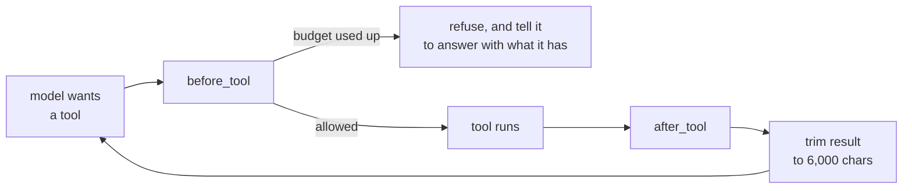

# The agent and its tools

There is one ADK `LlmAgent` with six tools. There are no sub-agents. The agent
is defined in [`agents/root_agent.py`](../backend/app/agents/root_agent.py)
and the tools in [`agents/tools/recon.py`](../backend/app/agents/tools/recon.py).

**Design rule: a tool either does a whole job or answers one question.** Every
tool call adds its result to the conversation, and the whole conversation is
re-sent with every later model call. Fewer, larger tools keep turns cheaper.
For example, `run_reconciliation` returns its rules, its coverage *and* what was
left unmatched in one result, so the agent doesn't need several follow-up calls
to find out.

---

## The six tools

### `list_datasets()`

Lists every uploaded file with its columns, types, row count and any extra
views. A cheap way to get oriented.

### `describe_dataset(dataset)`

Column statistics for one file: distinct count, nulls, min/max, most common
values, whether the column is unique, and a pattern of what the values look
like. Useful for telling an id column from an amount column. Takes a name or an
id.

### `query_data(sql)`

Runs one read-only `SELECT` or `WITH` query and returns the columns and the
first rows (10 by default). [`core/sqlguard.py`](../backend/app/core/sqlguard.py)
opens the database read-only and rejects anything that isn't a single select.

Use it to *look* at data, not to match it.

### `run_reconciliation(config)`

The tool that does the actual work. It has two modes:

| Mode | Config | What happens |
| --- | --- | --- |
| `auto` | `{"mode": "auto"}` | Runs the whole matching pipeline ([RULE-ENGINE.md](RULE-ENGINE.md)). **Start here; usually it's all you need.** |
| `rule` | `{"mode": "rule", "rule": ..., "sql": ..., "description": ...}` | Runs one hand-written rule, for a link the automatic pass skipped. The SQL must return `group_key`, `dataset` and `row` (and optionally `amount_minor`). |

Either mode can also take `{"spine": "<dataset>"}` to set which file the flow
of money starts from.

In `rule` mode, the rule name can't start with `auto_`, and reusing an existing
rule name with different SQL is refused. New rules start unapproved, so their
matches wait for a person.

The result lists the rules that ran (with join, shape, amount columns and how
well they agreed), the proposals by confidence, coverage per file, any links it
**skipped** and why, and any references it found inside text columns.

### `get_exceptions(filters)`

Everything that needs a person, in one call. Pass `{}` for everything, or
filter by `kind` (`unbalanced`, `ambiguous`, `verification_failed`,
`unmatched`), `dataset` and `limit`.

- `groups` are matches with a problem: amounts that don't balance, rows that
  could belong to two groups, or a group that failed verification.
- `unmatched` are rows that aren't in any accepted match.

Neither is necessarily an error. A bank statement has fees and balance lines
that no order will ever explain.

### `get_transaction_chain(transaction_id)`

Follows one id from start to finish, for questions like "what happened to
ORDER-1042?" It finds every row holding that value, follows the ids in those
rows into the other files, and reports the matches they belong to and their
history.

**It only reads; it never creates or changes matches.**

---

## Guardrails

| Guard | Where | Limit |
| --- | --- | --- |
| Exploration budget | `callbacks.before_tool` | 6 calls per turn to the five "looking" tools; `run_reconciliation` is never counted |
| Result size | `callbacks.after_tool` | 6,000 characters; the longest list is trimmed first |
| Model calls | ADK runner | 40 per turn |
| SQL | `sqlguard` | read-only connection, one select only |
| Rule approval | `matching.propose_matches` | agent rules need a person's approval; approval is tied to the rule's SQL |

### Gotchas when editing callbacks

- **Callbacks must take keyword-only arguments.** ADK calls them by keyword. A
  callback with positional parameters is silently never called, so run tracking
  just stops.
- **The budget counter is a mutable object inside a `ContextVar`, not an
  `int`.** ADK runs each tool call in a copied context. Setting a new value in
  a copy is lost when that call ends, but changing a shared object isn't. With
  a plain `int`, the budget never counted past 1.

---

## Token and cost tracking

`before_model` and `after_model` record each model call in `run_metric`:
prompt tokens, completion tokens, cached tokens, reasoning tokens, cost and
time. One turn makes many model calls, so **add up all the rows for a run**;
don't read only the last one.

Prices come from LiteLLM, or from OpenRouter's price list for models LiteLLM
doesn't know (`core/pricing.py`).

---

## What the agent is told not to do

The instructions in `root_agent.py` say:

- **Never state a number you worked out yourself.** Every figure must come from
  a tool result.
- **Never say something is reconciled** unless the pipeline approved it.
- **Report what didn't match** as clearly as what did.

These rules live only in the prompt, so they depend on the model following
them. The hard limits are in code: the read-only SQL connection, verification
before any `accepted` status, and rule approval.

At the start of each turn, a short summary of the current state (files, views,
likely joins, proposals so far) from `agents/state.py` is added to the instructions. That way the
agent doesn't spend calls finding out what already exists.
