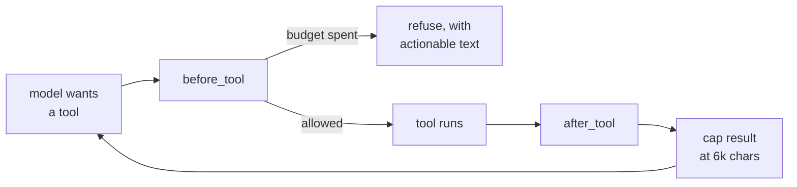

# The agent surface

One `LlmAgent` with six tools. There is no orchestrator/worker split and no
sub-agent tree — an earlier thirteen-tool surface cost a median of 10 model
calls and 45k tokens for a hundred rows, mostly spent re-deriving what an
earlier call already knew.

The rule that shapes all six: **a tool either does the whole job or answers a
question.** `run_reconciliation` returns its rules, its coverage *and* its
leftovers in one result, because the alternative — measured on a real turn — was
the agent following it with `reconciliation_status`, `list_unmatched`,
`list_proposals`, `get_proposal` and five SQL probes. Eight round trips to learn
what one function already knew, and every round trip is paid again in the
history of every later call.

---

## The six

### `list_datasets()`

Every uploaded dataset with its columns, types, row count and any published
views. The cheap orientation call.

### `describe_dataset(dataset)`

Per-column statistics for one file: distinct count, nulls, min/max, top values,
whether the column is unique, and a pattern signature. Tells an identifier from
an amount when the names do not. Accepts a name or an id.

### `query_data(sql)`

One read-only `SELECT` or `WITH`, returning columns and the first rows. Guarded
by [`core/sqlguard.py`](../backend/app/core/sqlguard.py), which opens the
database read-only and rejects anything that is not a single select.

For *looking* at data, not for matching it. Results stay in the conversation and
are re-sent on every later call, so an aggregate beats a page of rows.

### `run_reconciliation(config)`

The one that does the work. Two modes:

| Mode | Config | What happens |
| --- | --- | --- |
| `auto` | `{"mode": "auto"}` | The whole deterministic pipeline — discovery, cardinality, amounts, proposals, verification. Zero tokens spent on arithmetic. **Start here, and usually stop here.** |
| `rule` | `{"mode": "rule", "rule": ..., "sql": ..., "description": ...}` | One hand-written rule, for a relationship the automatic pass declined. The SQL must return `group_key`, `dataset`, `row`. |

Returns the rules it ran with their join, shape, strategy, amount relationship
and measured agreement; the groups proposed by confidence; per-dataset coverage;
any edges it **declined** and why; and any embedded keys it had to resolve.

Never budgeted (below): running out of an exploration allowance must not mean
leaving the job half done.

### `get_exceptions(filters)`

Everything needing a person, in one call. `{}` for all of it, or narrow by
`kind` (`unbalanced` · `ambiguous` · `verification_failed` · `unmatched`),
`dataset`, `limit`.

`groups` are matches with something wrong — amounts that do not tie, rows that
could join two ways, a group its own verification refused. `unmatched` are rows
in no accepted match at all.

Both are *findings*, not failures. A bank statement holds fees and balance lines
no order will ever explain, and the instruction is explicit that those must be
distinguished from real breaks.

### `get_transaction_chain(transaction_id)`

Follow one identifier end to end — "what happened to ORDER-1042", "did this
settle". Finds every row holding the value, follows the identifiers in those
rows into the other sources, and reports the matches they belong to with their
event history.

**Read only, records nothing.** Being asked about something is not permission to
reconcile it.

---

## Guardrails

| Guard | Where | Value |
| --- | --- | --- |
| Exploration budget | `before_tool` | 6 looking calls per turn |
| Result cap | `after_tool` | 6,000 chars, longest list trimmed first |
| Model calls | ADK runner | 40 per turn |
| SQL | `sqlguard` | read-only handle, single select only |
| Rule trust | `matching.release` | a new rule stays pending until approved once; approval is pinned to its SQL, and `auto_*` names are reserved |

`run_reconciliation` is exempt from the budget in both modes. The refusal text
is written to be *actionable* — it tells the model to answer with what it has,
because a refusal it cannot act on just becomes another wasted round trip.

> The budget was dead code for its entire life until it was measured. It held an
> `int` in a `ContextVar`, and ADK dispatches each tool call inside
> `asyncio.create_task` / `copy_context()` — a copied context shares object
> *references* but not *rebindings*, so `.set()` was discarded when each task
> ended and every call read back `spent = 1`. It now holds a mutable box that
> every copied context shares. A chatty model made 54 `query_data` calls against
> a budget of 6 before this was caught.

---

## Accounting

`before_model` / `after_model` open and close a run and record, per model call:
prompt tokens, completion tokens, cached tokens, reasoning tokens, cost and
latency into `run_metric`. **These must be summed, not taken from the last
call** — one turn makes many calls and each reports its own usage; reading only
the final one hides where the spend actually is.

The callbacks are declared **keyword-only** because ADK invokes them by keyword.
Positional parameters fail silently: the callback is never called, and every
piece of run tracking simply does not happen.

---

## What the agent may not do

The instruction in
[`agents/root_agent.py`](../backend/app/agents/root_agent.py) is explicit:

- **never state a figure it computed itself** — every number comes from a tool
  result, which came from SQL, which came from a source row;
- **never claim something reconciled** that the pipeline did not release;
- **report what did not reconcile** as plainly as what did.

Session state (`agents/state.py`) is snapshotted once per turn and injected into
the instruction, ~315 tokens, so the model starts each turn knowing what exists
without spending a call to find out.
